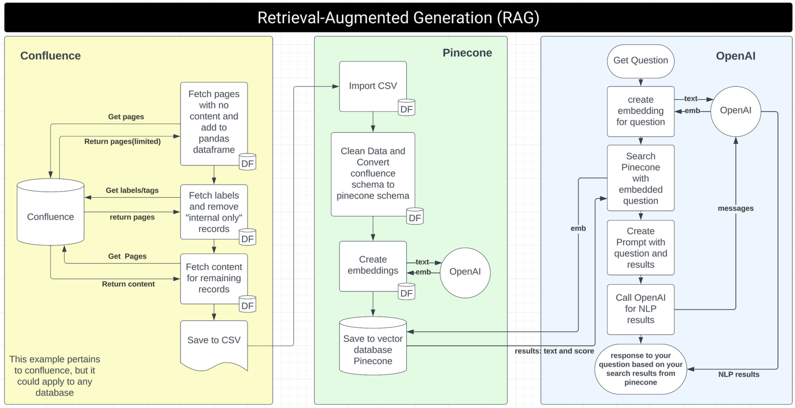

# RAG-DEMO: Retrieval Augmented Generation with Confluence and Pinecone

This project demonstrates Retrieval-Augmented Generation (RAG) using Confluence as a content source and Pinecone for vector storage.

## RAG Flow Chart
Please refer to the `rag_flowchart.png` in the repository for a visual representation of the system workflow.


## Project Structure

```
.
├── app_confluence.py          # Original Confluence integration script
├── app_confluence_v2.py       # Enhanced Confluence API v2 integration
├── app_pinecone_openai.py     # Pinecone and OpenAI integration
├── CONFLUENCE_API_README.md   # Confluence API usage guide
├── get_space_and_pages.py     # Simple space and page retrieval demo
├── rag_flowchart.png          # Architecture diagram
├── README.md                  # This file
├── requirements.txt           # Project dependencies
├── data/                      # Data storage directory
│   ├── confluence_pages.csv   # Pages extracted from Confluence
│   └── kb.csv                 # Knowledge base data
└── utils/                     # Utility modules
    ├── confluence_api.py      # Confluence API utilities
    ├── data_prep.py           # Data preparation utilities
    ├── openai_logic.py        # OpenAI integration
    └── pinecone_logic.py      # Pinecone integration
```

## Setup Instructions

1. Clone this repository:
```bash
git clone <repository-url>
cd ragDemo
```

2. Create a virtual environment:
```bash
python -m venv venv
source venv/bin/activate  # On Windows: venv\Scripts\activate
```

3. Install dependencies:
```bash
pip install -r requirements.txt
```

4. Create a `.env` file with your API credentials:
```
CONFLUENCE_DOMAIN=https://your-domain.atlassian.net
CONFLUENCE_TOKEN=your_api_token
CONFLUENCE_EMAIL=your_email@example.com
SPACE_KEY=optional_default_space_key
OPENAI_API_KEY=your_openai_api_key
PINECONE_API_KEY=your_pinecone_api_key
PINECONE_ENVIRONMENT=your_pinecone_environment
```

## Usage

### Automated Pipeline

Run the complete pipeline without any user input:
```bash
python run_automated_pipeline.py
```

This script will:
1. Get space ID and basic page information
2. Fetch detailed page content and labels
3. Run the RAG processing pipeline (if available)

### Manual Steps

#### Confluence Integration

1. List all available Confluence spaces and fetch pages for a specific space:
```bash
python get_space_and_pages.py
```

2. Get space ID and fetch pages for a specific space key:
```bash
python get_space_id_and_pages.py YOURSPACEKEY --limit 50
```

3. Fetch pages with content for a space key defined in .env:
```bash
python app_confluence_v2.py
```

#### Original Confluence Integration

The original script with simpler functionality:
```bash
python app_confluence.py
```

### RAG Pipeline

Run the full RAG pipeline with Pinecone and OpenAI:
```bash
python app_pinecone_openai.py
```

## Features

### Confluence Integration (v2)

- Fetch all Confluence spaces
- Get space ID by space key
- Fetch pages related to a space
- Extract page content and metadata
- Filter internal-only pages
- Save data to CSV for further processing

### RAG Pipeline

- Prepare text data for embedding
- Generate embeddings using OpenAI
- Store and retrieve vectors with Pinecone
- Perform semantic search
- Generate responses with context augmentation

## Detailed Documentation

For more information on using the Confluence API, see [CONFLUENCE_API_README.md](CONFLUENCE_API_README.md).

## Thank you and happy coding!
